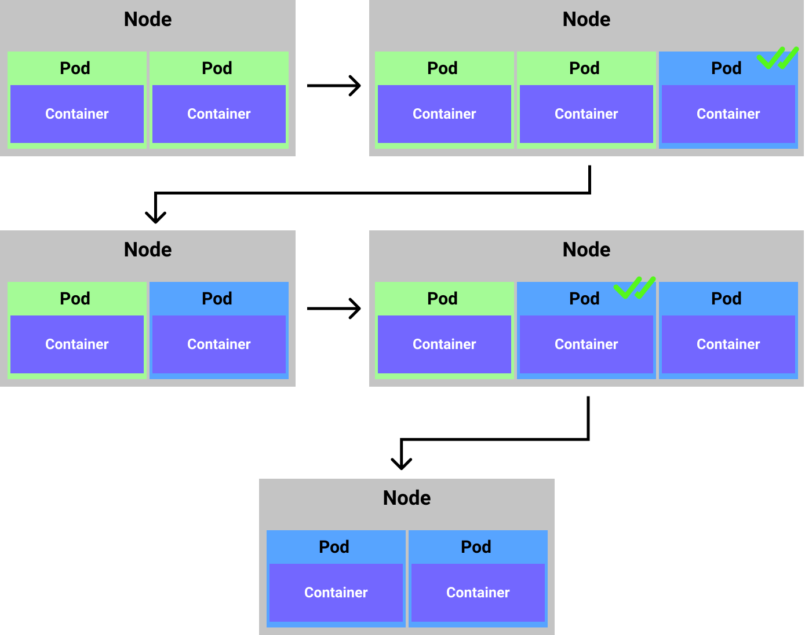

<p align=center>
  
</p>

# K8s Deployments

One of the best features of the k8s for developers is having a lot of flexibility when deploying the application. The k8s out of the box comes with some of the best practices that are out there and all of them enable us to have a `zero-downtime` deployment. This simply means that we can release a new version of the software without having an impact on the end user. The types of the deployments we can achieve using k8s are:

1. Rolling updates
2. Canary deployments
3. Blue/Green (A/B) deployments

Also one of the really great features in k8s is in case that our deployment fails for some reason, we can `rollback` easily back to the previous state that was working. The k8s keeps track of different versions and with a simple command we can just go "back" in case of any issues. This all sounds really great, especially as it ties in the picture of `CI/CD` lifecycle of the software. They complement each other and enable a developer to have confidence when releasing software by providing multiple options when doing so.

# Rolling updates

This type of the deployment is the **default** type of the deployment in the k8s. It supports 2 strategies of releasing to the cluster:

1. Rolling update: it causes no down-time
2. Recreate: it can cause down-time as it will recreate the current state by deleting resources and creating a "fresh" copy of them

When the deployment is started it goes through couple of "moves" to ensure that zero-downtime. The simplified version of it:

1. First it checks the current state of the cluster
2. Starts adding additional `pods` to the current state (n + 1)
3. Checks if the instance of the new pod is healthy and can receive traffic (liveness and readiness prob)
4. When it gets `success` back it starts routing traffic to the new instance and schedules to remove the instance of the old pods
5. Keeps going till all pods are "migrated" to the new desired state

<p align=center>
  
</p>

Now let us look an example of the rolling update declared declaratively (using `YAML`):

```yml
apiVersion: apps/v1
kind: Deployment
metadata:
  name: frontend
spec:
  replicas: 2
  revisionHistoryLimit: 5       # how many ReplicaSets to keep in history (default is 10) to allow the rollback back
  minReadySeconds: 1            # number of seconds before pod is considered health and can start handling requests
  progressDeadlineSeconds: 60   # how long to wait before reporting that deployment is stalled
  strategy:                     # this is by default, so need to add a strategy if's RollingUpdate (only if we wanna do Recreate)
    type: RollingUpdate
    rollingUpdate:
      maxSurge: 1               # how many pods above replicas count it can create during rolling update (25% by default)
      maxUnavailable: 1         # how many can be unavailable during the rolling update (25% by default)
  selector:
    matchLabels:
      app: frontend
  template:
    metadata:
      labels:
        app: frontend
    spec:
      containers:
      - name: frontend
        image: nginx:alpine
        resources:
          limits:
            memory: "128Mi"
            cpu: "500m"
        ports:
        - containerPort: 80
```

To apply this deployment to our cluster we can use the following command:

```bash
# --record => save this deployment in the history to be used in the case of rollback
kubectl apply -f src/rollingupdate.deployment.yaml --record
```

Now when we check the history of the rollout we can see this information:

```bash
# we can check the status of the specific deployment
k rollout status deployment frontend
deployment "frontend" successfully rolled out

kubectl rollout history deployment frontend
deployment.apps/frontend
REVISION  CHANGE-CAUSE
1         kubectl apply --filename=src/rollingupdate.deployment.yaml --record=true
```
