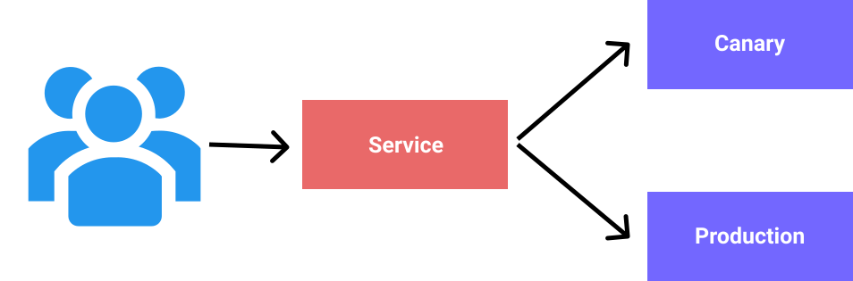

<p align=center>
  
</p>

#

One of the best features of the k8s for developers is having a lot of flexibility when deploying the application. The k8s out of the box comes with some of the best practices that are out there and all of them enable us to have a `zero-downtime` deployment. This simply means that we can release a new version of the software without having an impact on the end user. The types of the deployments we can achieve using k8s are:

1. Rolling updates
2. Canary deployments
3. Blue/Green (A/B) deployments

Also one of the really great features in k8s is in case that our deployment fails for some reason, we can `rollback` easily back to the previous state that was working. The k8s keeps track of different versions and with a simple command we can just go "back" in case of any issues. This all sounds really great, especially as it ties in the picture of `CI/CD` lifecycle of the software. They complement each other and enable a developer to have confidence when releasing software by providing multiple options when doing so.

# Rolling updates

This type of the deployment is the **default** type of the deployment in the k8s. It supports 2 strategies of releasing to the cluster:

1. Rolling update: it causes no down-time
2. Recreate: it can cause down-time as it will recreate the current state by deleting resources and creating a "fresh" copy of them

When the deployment is started it goes through couple of "moves" to ensure that zero-downtime. The simplified version of it:

1. First it checks the current state of the cluster
2. Starts adding additional `pods` to the current state (n + 1)
3. Checks if the instance of the new pod is healthy and can receive traffic (liveness and readiness prob)
4. When it gets `success` back it starts routing traffic to the new instance and schedules to remove the instance of the old pods
5. Keeps going till all pods are "migrated" to the new desired state

<p align=center>
  
</p>

Now let us look an example of the rolling update declared declaratively (using `YAML`):

```yml
apiVersion: apps/v1
kind: Deployment
metadata:
  name: frontend
spec:
  replicas: 2
  revisionHistoryLimit: 5       # how many ReplicaSets to keep in history (default is 10) to allow the rollback back
  minReadySeconds: 1            # number of seconds before pod is considered health and can start handling requests
  progressDeadlineSeconds: 60   # how long to wait before reporting that deployment is stalled
  strategy:                     # this is by default, so need to add a strategy if's RollingUpdate (only if we wanna do Recreate)
    type: RollingUpdate
    rollingUpdate:
      maxSurge: 1               # how many pods above replicas count it can create during rolling update (25% by default)
      maxUnavailable: 1         # how many can be unavailable during the rolling update (25% by default)
  selector:
    matchLabels:
      app: frontend
  template:
    metadata:
      labels:
        app: frontend
    spec:
      containers:
      - name: frontend
        image: nginx:alpine
        resources:
          limits:
            memory: "128Mi"
            cpu: "500m"
        ports:
        - containerPort: 80
```

To apply this deployment to our cluster we can use the following command:

```bash
# --record => save this deployment in the history to be used in the case of rollback
kubectl apply -f src/rollingupdate.deployment.yaml --record
```

Now when we check the history of the rollout we can see this information:

```bash
# we can check the status of the specific deployment
k rollout status deployment frontend
deployment "frontend" successfully rolled out

kubectl rollout history deployment frontend
deployment.apps/frontend
REVISION  CHANGE-CAUSE
1         kubectl apply --filename=src/rollingupdate.deployment.yaml --record=true
```

Ok, now that our deployment works we can experiment with rolling update. For this example (`/src/rollingupdate.deployment.yaml`) the simplest way is to change is to change the version of the *nginx* container being used (and scale the number of pods just to see it in action easier). Now let us assume that we did this, so let us apply first version with a lower number and then change it to latest (what is currently) and then apply that. To find a version of *nginx* you can check it at [Docker Hub](https://hub.docker.com/_/nginx).

```bash
kubectl apply -f src/rollingupdate.deployment.yaml --record

# let us also apply a load balancing service
kubectl apply -f src/rollingudate.service.yaml --record

# now we can change back to the latest version of the nginx in the rollingupdate.deployment.yaml
kubectl apply -f src/rollingupdate.deployment.yaml --record
deployment.apps/frontend configured

# I have configure to 5 replicas, but here we can see that at one point there was 6
kubectl get all
NAME                            READY   STATUS              RESTARTS   AGE
pod/frontend-7978bd5598-gzd9q   0/1     ContainerCreating   0          0s
pod/frontend-8987bb8d9-2pt9z    1/1     Running             0          47s
pod/frontend-8987bb8d9-8pddk    1/1     Running             0          47s
pod/frontend-8987bb8d9-czm9n    1/1     Running             0          47s
pod/frontend-8987bb8d9-jw4qg    1/1     Terminating         0          47s
pod/frontend-8987bb8d9-rgg6d    1/1     Running             0          47s

NAME                    TYPE           CLUSTER-IP    EXTERNAL-IP   PORT(S)        AGE
service/kubernetes      ClusterIP      10.96.0.1     <none>        443/TCP        6d
service/nginx-service   LoadBalancer   10.99.86.49   localhost     80:30780/TCP   42s

NAME                       READY   UP-TO-DATE   AVAILABLE   AGE
deployment.apps/frontend   4/5     1            4           47s

NAME                                  DESIRED   CURRENT   READY   AGE
replicaset.apps/frontend-7978bd5598   2         1         0       0s
replicaset.apps/frontend-8987bb8d9    4         4         4       47s

```

Also now that we check the history of the deployments we should see this:

```bash
kubectl rollout history deployment frontend
deployment.apps/frontend
REVISION  CHANGE-CAUSE
1         kubectl apply --filename=src/rollingupdate.deployment.yaml --record=true
2         kubectl apply --filename=src/rollingupdate.deployment.yaml --record=true
```

Now we can rollback the deployment with the following command:

```bash
kubectl rollout undo deployment frontend
deployment.apps/frontend rolled back

# to verify the rollback exec into the pod
kubectl exec frontend-8987bb8d9-4hmht -it sh # get the pods using kubectl get pods

# within the pod run the following command
nginx -v
nginx version: nginx/1.16.1 # latest version at this point of nginx is 1.17.1
```

## Canary deployments

Now let us talk about an awesome way, that we also get for "free" with k8s, that allows us to test our new feature in a controlled way. The canary deployment allows you to run in parallel 2 versions of your application. You can route the traffic towards them based on some rules you setup. Lets say that rule can be that 5% of traffic goes to the new version of the software in the cluster and 95% goes to the current version running within the cluster. Canary release is a technique to reduce the risk of introducing a new software version in production by slowly rolling out the change to a small subset of users before rolling it out to the entire infrastructure and making it available to everybody (an take on the definition of the canary release from the internet).

<p align=center>
  
</p>

The canary deployment involves the following resources:

1. Service that will route traffic between the deployments
2. Deployment that will be the current desired state
3. Deployment that has the new desired state that we wish to test

For sake of testing I created the 2 simple examples using nginx. Tho that is not enough I `exec` into the 1 pod that was in the canary deployment and manually changed `html`. So down bellow is the result of running the deployments:

```bash
kubectl apply -f src/canary.current.deployment.yaml --record
...
kubectl apply -f src/new.current.deployment.yaml --record
...
kubectl apply -f src/canary.service.yaml
...

# now some commands to exec and change the file that not gonna show, or if you wanna make it simpler just use 2 different container of some test app you have

# now let us run some requests and we should see something similar like bellow
 http GET http://localhost | grep canary
<title>Welcome to nginx-canary!</title>
❯ http GET http://localhost | grep canary
❯ http GET http://localhost | grep canary
❯ http GET http://localhost | grep canary
❯ http GET http://localhost | grep canary
❯ http GET http://localhost | grep canary
❯ http GET http://localhost | grep canary
<title>Welcome to nginx-canary!</title>
❯ http GET http://localhost | grep canary
```

The process is same as any other deployment. So simple and yet so powerful.
